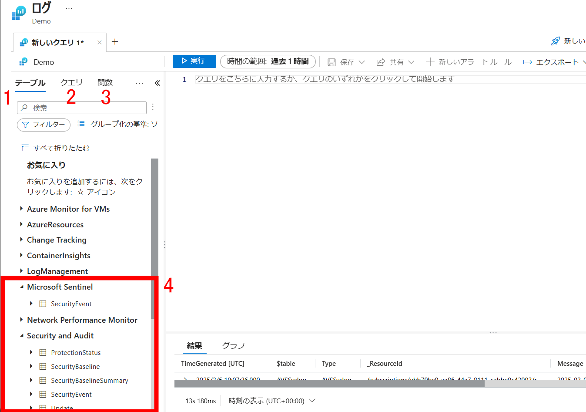
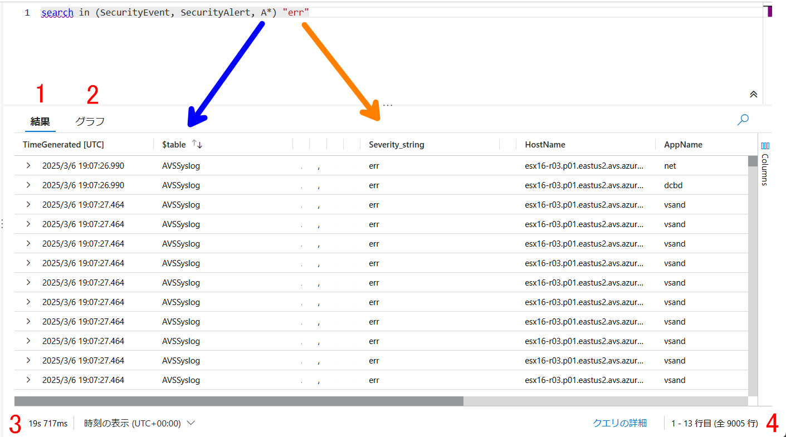
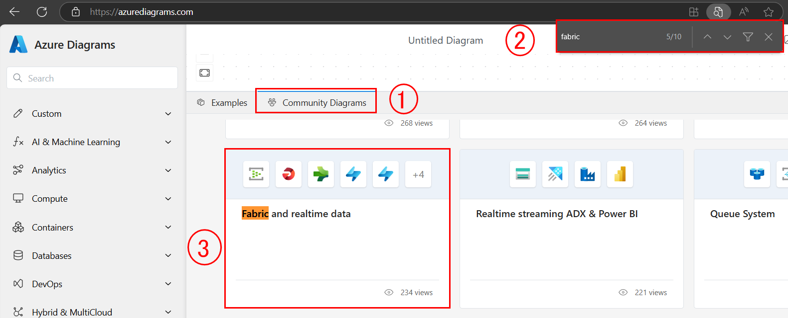
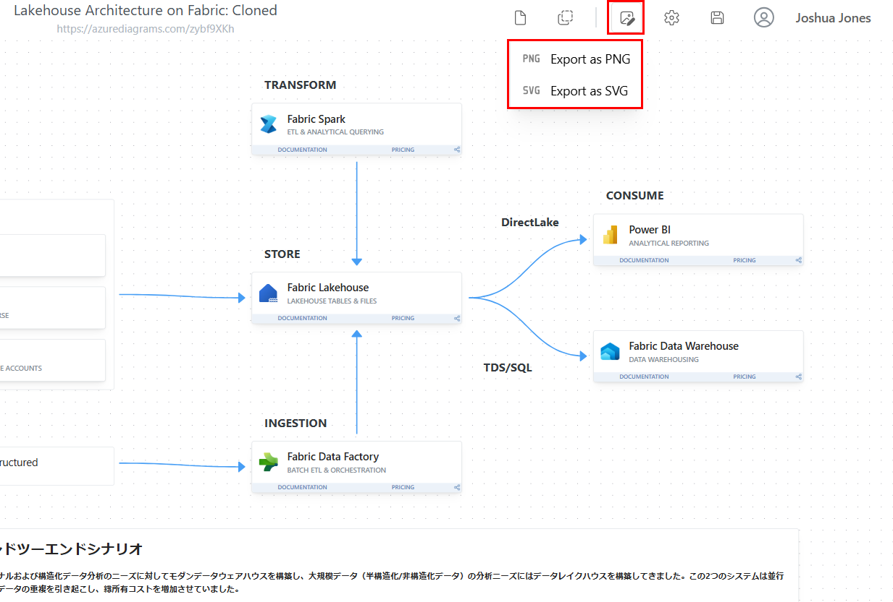

# 🔎KQLとLog Analyticsについて☁️

## KQL
Kusto クエリ言語 (KQL) は、データの探索やパターンの検出、異常や外れ値の特定、統計モデリングの作成などを行う強力なツールです。 KQL は、構造化データ、半構造化データ、非構造化データに対してクエリを実行するための、シンプルでありながら強力な言語です。 この言語は表現力があり、読みやすく、クエリの意図を理解しやすく、作成エクスペリエンス用に最適化されています。 Kusto クエリ言語は、テキスト検索と解析、時系列演算子と関数、分析と集計、地理空間、ベクトル類似性検索、およびデータ分析に最適な言語を提供するその他の多くの言語コンストラクトを深くサポートするテレメトリ、メトリック、ログのクエリに最適です。 このクエリでは、SQL に似た階層 (データベース、テーブル、列) に編成されたスキーマ エンティティが使用されます。

## Log Analyticsワークスペース
Log Analytics ワークスペースは、すべての Azure および Azure 以外のリソースとアプリケーションから任意の種類のログ データを収集できるデータ ストアです。 ワークスペース構成オプションを使用すると、次の方法で、すべてのログ データを 1 つのワークスペースで管理し、組織内のさまざまな担当者の操作、分析、監査のニーズを満たすことができます。

<table>
  <tr>
    <th>⭐注目⭐</th>
  </tr>
  <tr>
    <td>Microsoft Sentinel では、"Microsoft Sentinel ワークスペース" という用語が使用されています。 このワークスペースは、Log Analytics ワークスペースと同じですが、Microsoft Sentinel で使用できるようになっています。 ワークスペース内のすべてのデータには、Microsoft Sentinel の価格が適用されます。</td>
  </tr>
</table>  

# ☁️Azureのアカウント作成☁️
❗既にアカウントをお持ちの方は次のセクションに進んでください。

まずは以下のリンクにアクセスしてください

<a href="https://azure.microsoft.com/ja-jp/pricing/purchase-options/azure-account" target="_blank">https://azure.microsoft.com/ja-jp/pricing/purchase-options/azure-account</a>

左側にある無料アカウントのオプションを選択

プロファイル情報を入力する

クレジットカードの情報を入力する
アカウント登録してから、1回アカウントに１００円ぐらいの料金が発生します。これはカードが有効か確認するためにあって、すぐ同じ金額が自動的に返されます。

<table>
  <tr>
    <th>ℹ️自動請求なし</th>
  </tr>
  <tr>
    <td>「お客様のクレジットが終了後、従量課金制を続行するかどうかお尋ねします。続行する場合、サービスの無料分を超えて使用した場合にのみ支払うことになります。」</td>
  </tr>
</table> 

# 🔎Log Analyticsデモにアクセス🛡️

以下のリンクをブラウザの別タブでアクセスしてください。

<!-- This link format lets us open in a seperate tab 😇 -->
<a href="https://aka.ms/lademo" target="_blank">https://aka.ms/lademo</a>

右上の青色バッテン ✖ を押してください。

## ツールの案内と説明

使い方1️⃣：アクション バー

1. **実行**: クエリウィンドウに入っているクエリが実行されます。代わりに、Shift + Enter でも実行可能
    
1. **時間の範囲**: クエリで使用できるデータの時間範囲。クエリに時間のフィルターが含まれている場合は、時間の範囲がオーバーライドされる
    
1. **保存**:　クエリをクエリ パックに保存する。今回の演習では無効となっている

1. **共有**: 次のアイテムをコピーする
   - クエリへのリンク
   - クエリのテキスト
   - クエリの結果
    
1. **新しいアラートルール**: 警告ルールの[作成]ページ を開く。 このページを使用して、アラートの種類がログ検索アラートの警告ルールを作成する。 [条件] タブが選択された状態でページが開き、[検索クエリ] フィールドにクエリが追加される

    ※デモでは無効  
    
1. **エクスポート**: クエリの結果を CSV ファイルにエクスポートする。クエリを Power BI で使用するための Power Query Formula Language 形式にエクスポートする事も可能

1. **ピン留め先**: 次のアクションが可能
   - Azureダッシュボードにピン留めする
   - Azureブックに追加する

1. **クエリの形式設定**: 選択したテキストを読みやすく配置する

使い方2️⃣：左側サイド バー

1. **テーブル**: ワークスペースに含まれるテーブル
       
1. **クエリ**: プリビルトのクエリ。選択して、右のクエリウィンドウに追加する
    
1. **関数**:　コマンドのように、他のLog Analyticsのログ クエリに対して使えるクエリ。

1. **テーブル一覧**: カテゴリーを開いて、ワークスペースに含まれているテーブルの確認ができる。Securityを開いてみましょう。

使い方3️⃣：結果ウィンドウ

1. **結果**: クエリしたデータがテーブル（列ｘ行）形式で表示される
    
1. **グラフ**: クエリしたデータを視覚化で表示
    
1. **クエリ時間**: クエリを実施するためかかった時間

1. **結果の範囲**: 表情されている行と全て行のカウント

1. **青色矢印**: search in でテーブルをフィルターする。A*利用すると、Ａで始まるテーブル名が選択される。これで、AVSSyslogがクエリされた

1. **オレンジ色矢印**: errというテキストが含まれる行が検索される

# ✅Fabricのサンプル アーキテクチャ図を確認する✅

<link rel="stylesheet" href="//cdnjs.cloudflare.com/ajax/libs/highlight.js/10.7.2/styles/default.min.css">

<pre><code class="kusto">
search "err"
</code></pre>

<link rel="stylesheet" href="//cdnjs.cloudflare.com/ajax/libs/highlight.js/10.7.2/styles/default.min.css">

<pre><code class="kusto">
search in (SecurityEvent,SecurityAlert,A*) "err"
</code></pre>

**1️⃣**

左下にある **Examples** を押します

**2️⃣**

Examplesのウィンドウが開かれます。ウィンドウの上をマウスで掴んで(1)、サイズを調整します。
Fabricのサンプル図 **Lakehouse Architecture on Fabric**を探して、クリックします。(2)

**3️⃣**

**Fabric Data Factory**と**Fabric Lakehouse**の間にある接続をマウスでかざして、統合の詳細が **Batch & Scheduled**となっている事を確認します。

**4️⃣**

コミュニティーが提供している例もあります。**Community Diagrams**を押し、ブラウザのページ上検索（Ctrl+F)に「Fabric」を入力して、好きなサンプルを選びます。

# 🏠Fabricのアーキテクチャ図を作成する🌊

## 演習

1. lab 01-04 で実施した内容を Azure Diatrams を使用して作図しましょう

1. （option）1. の図をクローンし、lab 05-07 の内容を反映してみましょう

1. lab 01-04 の作図をメダリオンアーキテクチャとして拡張しましょう

| Header 1 | Header 2 | Header 3 |
|----------|----------|----------|
| Row 1 Col 1 | Row 1 Col 2 | Row 1 Col 3 |
| Row 2 Col 1 | Row 2 Col 2 | Row 2 Col 3 |

### 回答例

1. [lab 01-04 の回答例へのリンク](./images/diagram-01-04.png)
   1. [Azure Diagrams](https://azurediagrams.com/D54ivtsh)
2. [lab 05-07 の回答例へのリンク](./images/diagram-05-07.png) 
   1. [Azure Diagrams](https://azurediagrams.com/e4F4s7l8)
3. [メダリオンアーキテクチャの回答例へのリンク](./images/diagram-medallion.png)
   1. [Azure Diagrams](https://azurediagrams.com/NhmRmML4)

# 📂図のエクスポートと共有🔗

<u><b>図の共有方法は２つあります</b></u>

方法1️⃣：画像として保存

PNGとSVGは使えます。右上の画像アイコンを押して、ファイルタイプを選択します。

SVGを選ぶと、ライブインタラクション（スクロール等）ができます

方法2️⃣：図へのアクセスを共有

３つの共有タイプがあります。
1. **Community**:図は検索可能で、誰でも閲覧でき、**Community Diagrams** に表示されます。
    
1. **Link**:図は検索から隠されていますが、ユニークなリンクを持っている人なら誰でもアクセスできます。

1. **Private**:図は共有した人だけがアクセスできます。

共有するために、Diagram を保存して、設定の歯車 ⚙ を押します。

設定のオプションから、Sharing 👥 を押します。

## リソース

- [Microsoft Fabric でメダリオン Lakehouse アーキテクチャを実装](https://learn.microsoft.com/jp-ja/fabric/onelake/onelake-medallion-lakehouse-architecture)
- [Microsoft Fabric のグリーンフィールド レイクハウス](https://learn.microsoft.com/ja-jp/azure/architecture/example-scenario/data/greenfield-lakehouse-fabric)
- [Microsoft Fabric 開発ガイド](https://speakerdeck.com/ryomaru0825/microsoft-fabric-kai-fa-gaido?slide=31)
